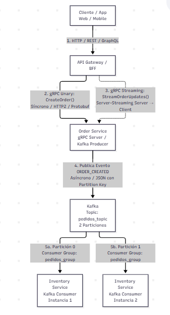
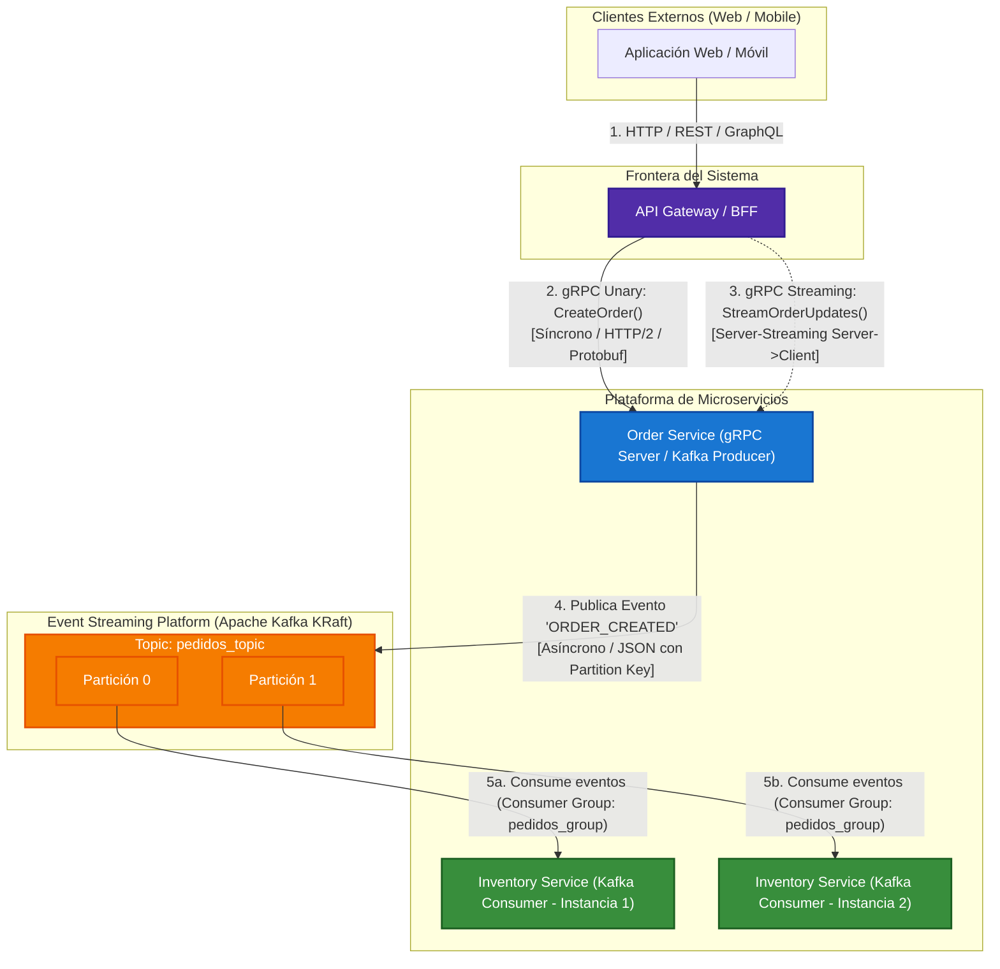

# Sistema de E-Commerce Distribuido: Microservicios con gRPC y Apache Kafka

Este proyecto implementa una arquitectura moderna de microservicios híbrida (síncrona y asíncrona) orientada a eventos para una plataforma de comercio electrónico. Combina **gRPC (Protocol Buffers sobre HTTP/2)** para interacciones de baja latencia y contratos fuertemente tipados, con **Apache Kafka (en modo KRaft sin Zookeeper)** para mensajería asíncrona desacoplada, escalabilidad horizontal y tolerancia a fallos.

---

## 1. Diagrama de Arquitectura

El siguiente diagrama modela el flujo integral entre el cliente, el **API Gateway**, el **Order Service** y el **Inventory Service**, destacando los límites síncronos y asíncronos del sistema:



<details>
<summary><b>Haz clic aquí para ver el código fuente en Mermaid.js</b></summary>



</details>

---

## 2. Justificación Técnica de la Arquitectura

En el diseño de sistemas distribuidos de alto rendimiento, la selección del estilo de comunicación adecuado para cada frontera de servicio es un factor determinante para el cumplimiento de los acuerdos de nivel de servicio (SLAs), la escalabilidad y la disponibilidad general. En este ecosistema conviven dos patrones fundamentales:

### A. Comunicación Síncrona: API Gateway $\rightarrow$ Order Service vía gRPC

La interacción entre el **API Gateway** y el **Order Service** requiere una comunicación síncrona inmediata: cuando un usuario presiona "Comprar", espera una confirmación instantánea que certifique que su solicitud fue validada y su orden registrada con un identificador único. **gRPC** es la tecnología idónea para este tramo por las siguientes razones de ingeniería:

1. **Serialización Binaria y Eficiencia de Recursos**: A diferencia de REST sobre JSON, gRPC utiliza **Protocol Buffers (Protobuf)**, un formato de serialización binaria compacta que reduce significativamente el tamaño del payload (hasta un 60-80% menos ancho de banda) y elimina el costo computacional de serialización/deserialización de texto.
2. **Multiplexación y Transporte HTTP/2**: gRPC aprovecha las capacidades nativas de HTTP/2, permitiendo multiplexar múltiples peticiones y respuestas concurrentes a través de una única conexión TCP de larga duración (*connection reuse*). Esto reduce la sobrecarga de *handshakes* SSL/TLS y la latencia de red en comunicaciones este-oeste (*service-to-service*).
3. **Contratos Estrictos Fuertemente Tipados**: El archivo `.proto` actúa como una única fuente de la verdad (*Single Source of Truth*). La generación de stubs y tipos previene errores en tiempo de ejecución, fomenta la interoperabilidad políglota y garantiza compatibilidad hacia atrás o adelante mediante esquemas evolucionables.
4. **Soporte Nativo de Streaming Bidireccional**: Para funcionalidades reactivas como el seguimiento del ciclo de vida de una orden (`StreamOrderUpdates`), el servidor puede enviar eventos continuos sobre la misma conexión TCP sin incurrir en soluciones ineficientes como el sondeo (*polling*) o WebSockets adicionales.

### B. Comunicación Asíncrona: Order Service $\rightarrow$ Inventory Service vía Apache Kafka

Una vez que la orden ha sido formalmente creada en el sistema, la reserva de stock físico, preparación en almacén, actualización contable y notificaciones no deben bloquear el hilo de ejecución principal ni demorar la respuesta entregada al cliente final. Para este enlace este-oeste, **Apache Kafka** representa la solución óptima:

1. **Desacoplamiento Temporal y Espacial**: El `Order Service` no necesita conocer la ubicación de red, la disponibilidad ni el número de réplicas del `Inventory Service`. Solo publica el evento `ORDER_CREATED` en el topic `pedidos_topic`. Si el microservicio de inventario sufre una caída temporal o una ventana de mantenimiento, la creación de pedidos no se interrumpe.
2. **Tolerancia a Fallos y Persistencia en Disco**: Kafka garantiza durabilidad mediante un log inmutable distribuido en disco. Los mensajes no se destruyen al ser leídos; permanecen persistidos según las políticas de retención, permitiendo reprocesar eventos (*event replay*) en caso de fallos lógicos o recuperación de desastres.
3. **Control de Presión Inversa (*Backpressure*) y Balanceo Horizontal**: En picos de alta demanda (e.g., Cyber Monday), las órdenes pueden registrarse a un ritmo mayor del que la bodega física puede procesar. Con Kafka, los consumidores leen bajo demanda (*pull model*), evitando el desbordamiento de memoria.
4. **Escalabilidad por Grupos de Consumidores (*Consumer Groups*)**: Al configurar el topic con múltiples particiones (e.g., 2 particiones), dos o más instancias del `Inventory Service` suscritas al grupo `pedidos_group` se reparten automáticamente la carga de procesamiento sin requerir balanceadores de carga externos, garantizando además el orden estricto de eventos por clave (*partition key*).

---

## 3. Estructura del Proyecto

```text
.
├── docs/
│   └── arquitectura.png         # Diagrama gráfico de la arquitectura del sistema
├── proto/
│   ├── store.proto              # Definición de StoreService y mensajes gRPC
│   ├── store_pb2.py             # Código Python generado (Serialización Protobuf)
│   └── store_pb2_grpc.py        # Código Python generado (Stubs de Servidor y Cliente)
├── docker-compose.yml           # Clúster de Apache Kafka local (modo KRaft, sin Zookeeper)
├── grpc_server.py               # Servidor gRPC en puerto 50051 (StoreService)
├── grpc_client.py               # Cliente gRPC para invocar CreateOrder y StreamOrderUpdates
├── kafka_producer.py            # Productor de eventos de pedidos hacia Kafka
├── kafka_consumer.py            # Consumidor de pedidos en grupo pedidos_group con lectura de partición
├── requirements.txt             # Dependencias del proyecto Python
└── README.md                    # Documentación y guía de ejecución
```

---

## 4. Requisitos Previos

- **Python**: Versión 3.10 o superior (verificado con Python 3.12).
- **Docker** y **Docker Compose** instalados y en ejecución.

---

## 5. Instrucciones de Ejecución Paso a Paso

### Paso 1: Instalación de Dependencias

Crea y activa un entorno virtual (opcional pero recomendado) e instala las dependencias:

```bash
pip install -r requirements.txt
```

### Paso 2: Compilación de los Archivos Protocol Buffers (`.proto`)

Ejecuta el compilador `protoc` integrado en `grpc_tools` desde la raíz del proyecto para generar el código cliente/servidor:

```bash
python -m grpc_tools.protoc -I. --python_out=. --grpc_python_out=. proto/store.proto
```

> **Nota:** Este comando genera automáticamente `proto/store_pb2.py` y `proto/store_pb2_grpc.py`.

---

### Paso 3: Levantar el Clúster de Apache Kafka (KRaft)

Inicia el contenedor de Kafka en segundo plano utilizando Docker Compose:

```bash
docker compose up -d
```

Verifica que el servicio esté arriba y saludable:

```bash
docker compose ps
```

---

### Paso 4: Crear el Topic en Kafka con 2 Particiones

Crea el topic `pedidos_topic` con **2 particiones** y un factor de replicación de **1** ejecutando la herramienta de línea de comandos interna del contenedor:

```bash
docker exec -it kafka kafka-topics --create --topic pedidos_topic --partitions 2 --replication-factor 1 --bootstrap-server localhost:9092
```

Para verificar que el topic y sus 2 particiones se crearon correctamente:

```bash
docker exec -it kafka kafka-topics --describe --topic pedidos_topic --bootstrap-server localhost:9092
```

---

### Paso 5: Ejecución y Pruebas de gRPC (Síncrono)

#### 5.1 Iniciar el Servidor gRPC
Abre una terminal y ejecuta:

```bash
python grpc_server.py
```
*El servidor iniciará escuchando en el puerto `50051`.*

#### 5.2 Ejecutar el Cliente gRPC
Abre una segunda terminal y ejecuta el cliente:

```bash
python grpc_client.py
```

**Resultado esperado:**
1. El cliente enviará un `OrderRequest` mediante la llamada Unary `CreateOrder` y recibirá un `OrderResponse` con el ID único asignado.
2. Inmediatamente después, el cliente consumirá el stream `StreamOrderUpdates` en tiempo real, imprimiendo cada cambio de estado (desde `ORDER_RECEIVED` hasta `DELIVERED`).

---

### Paso 6: Ejecución y Pruebas de Kafka (Asíncrono)

Para evidenciar el **reparto de carga de particiones en un Consumer Group**, abriremos dos terminales para los consumidores y una tercera para el productor.

#### 6.1 Iniciar el Consumidor 1 (Instancia A)
En una nueva terminal:

```bash
python kafka_consumer.py "Consumidor-A"
```

#### 6.2 Iniciar el Consumidor 2 (Instancia B)
En otra terminal separada:

```bash
python kafka_consumer.py "Consumidor-B"
```

> Al pertenecer ambos al mismo `group_id="pedidos_group"`, Kafka asignará automáticamente la **Partición 0** a un consumidor y la **Partición 1** al otro.

#### 6.3 Ejecutar el Productor de Eventos
En una tercera terminal, ejecuta el productor:

```bash
python kafka_producer.py
```

**Resultado esperado en consola:**
- El productor enviará eventos con diferentes claves de cliente (`customer_id`).
- Kafka distribuirá los mensajes entre la **Partición 0** y la **Partición 1**.
- Cada terminal de consumidor mostrará en consola los mensajes que le corresponden indicando explícitamente:
  `[ PARTICIÓN 0 ]` o `[ PARTICIÓN 1 ]`.

---

## 6. Comandos Útiles de Limpieza

Para detener los servicios de Docker y limpiar los recursos creados:

```bash
docker compose down -v
```
